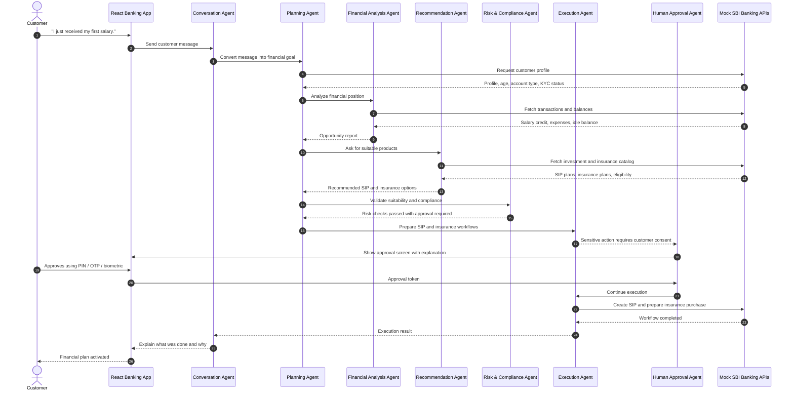
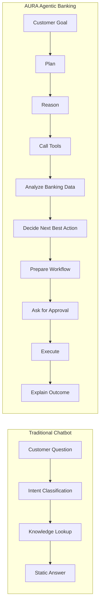
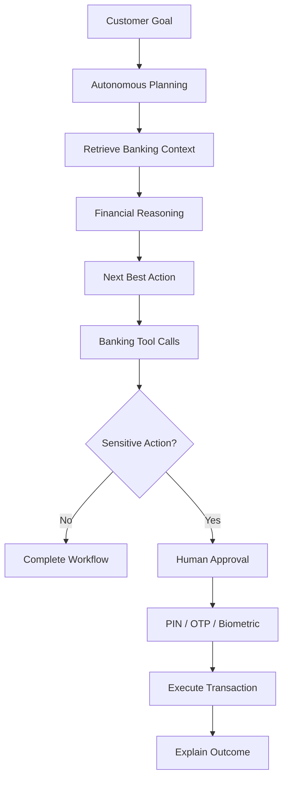
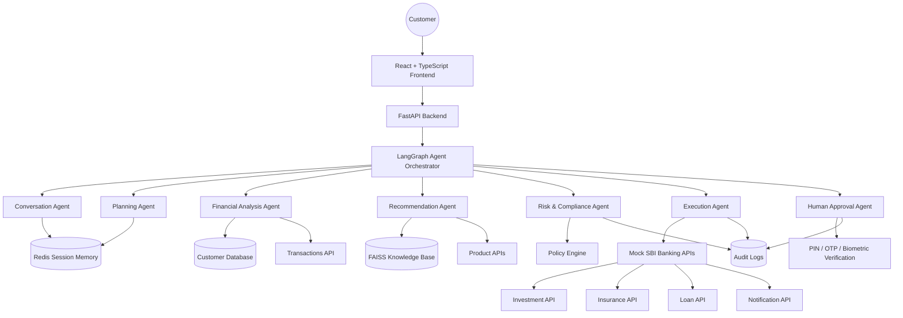
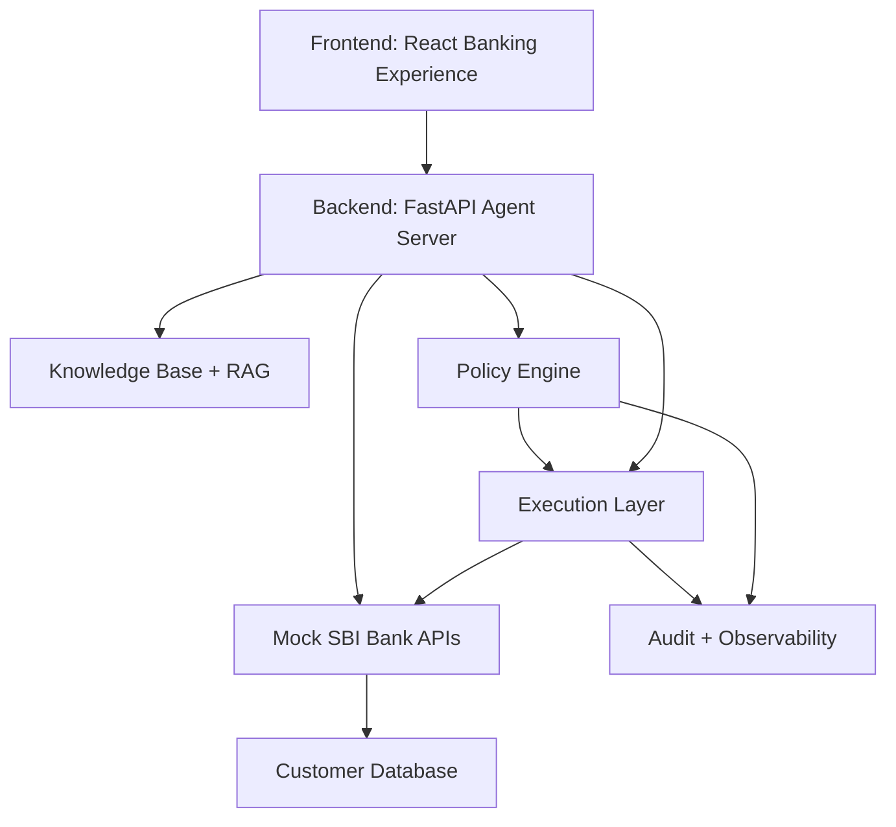
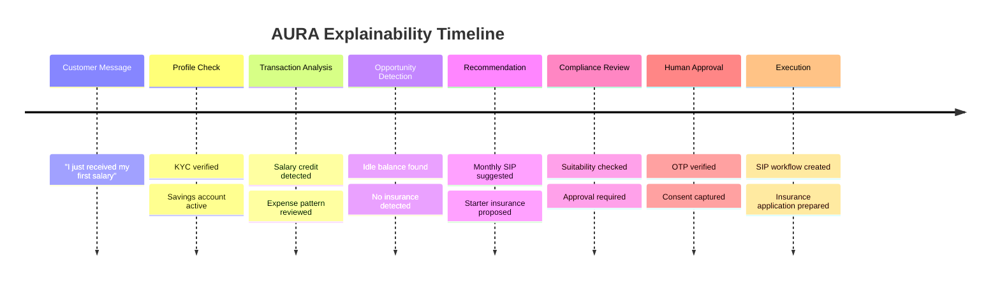

# AURA – Autonomous User Relationship Agent

<div align="center">

## "The Future of Intelligent Banking."

**An agentic AI banking assistant built for the SBI Global Fintech Fest 2026 Hackathon.**

[](#)
[](#)
[](#)
[](#)
[](#)
[](#license)

**AURA turns passive digital banking into an autonomous, goal-driven financial experience.**

[Overview](#overview) •
[Hero Demo](#hero-demo) •
[Architecture](#architecture) •
[License](#license)

</div>

---

<a id="overview"></a>

## 🏦 Overview

AURA, the **Autonomous User Relationship Agent**, is an Agentic AI Banking Assistant designed to behave less like a chatbot and more like an intelligent banking employee.

Traditional banking assistants wait for the customer to ask a narrow question. AURA understands the customer's financial goal, reasons over available banking data, plans the next best actions, calls internal banking APIs, recommends suitable financial products, and prepares workflows for execution. For sensitive actions such as investments, insurance purchases, transfers, or loan applications, AURA pauses and requests explicit customer approval before completing the transaction.

The result is a new kind of banking interface:

> **AURA does not just answer banking questions. It helps customers move toward better financial outcomes.**

Built for the **SBI Global Fintech Fest 2026 Hackathon**, AURA focuses on one of the biggest challenges in digital banking: customers are acquired successfully, but many never meaningfully activate high-value digital products such as SIPs, insurance, investments, credit cards, and loans.

AURA solves this by becoming a proactive relationship layer across the bank. It detects financial opportunities, explains them clearly, recommends the next best product, and automates the journey from intent to approval.

---

## 🎯 The Problem

Millions of users download banking apps, create accounts, and receive salaries into their savings accounts. Yet a large portion of these users remain digitally inactive. They may open the app to check balances or view transactions, but they often do not explore financial products that can improve their long-term financial health.

Customers frequently:

| Customer Behavior | Banking Impact |
| --- | --- |
| Keep large idle balances in savings accounts | Low wealth creation and missed investment adoption |
| Never start a SIP or recurring investment | Weak long-term financial planning |
| Delay buying insurance | Unmanaged personal and family risk |
| Ignore credit card, loan, and investment offers | Lower product activation and reduced engagement |
| Struggle to understand financial planning | Higher dependency on branches and support teams |
| Abandon forms and product journeys | Lost conversion across digital channels |

Most banking applications are structurally passive. They show menus, balances, banners, offers, and product pages, but they wait for the customer to decide what to do.

That creates a gap:

> **Banks have the products. Customers have the need. The missing layer is intelligent activation.**

AURA is that layer.

---

## 💡 The Solution

AURA transforms banking from a passive application into an autonomous financial relationship experience.

Instead of expecting a customer to navigate menus, compare products, calculate affordability, read policy details, and manually execute every step, AURA coordinates the journey end to end.

When a customer expresses a goal such as:

- "I just received my first salary."
- "Help me save for a house."
- "Can I afford health insurance?"
- "I want to invest, but I do not know where to start."
- "How should I use my idle balance?"

AURA can:

1. Understand the customer's intent and financial context.
2. Retrieve customer profile and account details from banking APIs.
3. Analyze transaction history, balances, income, spending, and liabilities.
4. Detect financial gaps such as idle savings, missing insurance, or low emergency reserves.
5. Generate a multi-step plan tailored to the customer's needs.
6. Recommend suitable products such as SIPs, insurance, loans, or goal plans.
7. Explain the recommendation in simple language.
8. Prepare the banking workflow for execution.
9. Ask for human approval before any sensitive transaction.
10. Execute the approved workflow through secure banking APIs.

This makes AURA a digital adoption engine for banks and a personal finance companion for customers.

---

<a id="hero-demo"></a>

## 🚀 Hero Demo

### Scenario: "I just received my first salary."

The customer opens the banking app and sends one simple message:

> **Customer:** "I just received my first salary."

A typical chatbot might congratulate the user or explain how to create a fixed deposit. AURA goes further. It treats the statement as a financial life event and autonomously builds a plan.

### AURA's Autonomous Workflow



### Demo Outcome

In one interaction, AURA can:

| Step | Autonomous Action | Customer Value |
| --- | --- | --- |
| 1 | Detect salary credit | Understands a meaningful financial event |
| 2 | Analyze idle balance | Finds unused money that can be put to work |
| 3 | Review transaction history | Estimates realistic monthly investment capacity |
| 4 | Identify missing insurance | Detects an important protection gap |
| 5 | Recommend SIP amount | Starts disciplined wealth creation |
| 6 | Recommend insurance | Improves financial resilience |
| 7 | Prepare workflows | Reduces form-filling and abandonment |
| 8 | Request approval | Keeps the customer in control |
| 9 | Execute approved action | Converts advice into real banking adoption |
| 10 | Explain completion | Builds trust through transparency |

---

## 🧠 What Makes AURA Agentic

AURA is not a prompt wrapper and it is not a traditional FAQ bot. It is designed as a multi-agent system capable of planning, reasoning, tool calling, decision making, workflow execution, and human-in-the-loop approval.

### Traditional Chatbot vs AURA



### The Difference

| Capability | Traditional Chatbot | Rule-Based Banking App | AURA |
| --- | --- | --- | --- |
| Understands natural language | Yes | Limited | Yes |
| Interprets customer life events | No | No | Yes |
| Retrieves customer context | Limited | Yes | Yes |
| Reasons across profile, transactions, and goals | No | No | Yes |
| Creates a multi-step financial plan | No | No | Yes |
| Calls banking APIs autonomously | Rarely | Fixed flows only | Yes |
| Recommends products contextually | Basic | Rule-based | Agentic and personalized |
| Executes workflows | No | Manual user journey | Yes, after approval |
| Explains decisions | Basic | No | Yes |
| Uses human approval for sensitive actions | Sometimes | Yes | Yes, built into the agent loop |

AURA follows a goal-to-completion model:



---

## ✨ Core Features

| Feature | Description |
| --- | --- |
| Conversational Banking | Natural language interface for everyday banking goals, questions, and workflows. |
| Personal Finance Advisor | Understands income, expenses, idle balances, and financial gaps. |
| Autonomous Financial Planning | Builds multi-step plans across savings, investments, insurance, and goals. |
| SIP Recommendation | Calculates an affordable monthly SIP based on income, expenses, and cash flow. |
| Insurance Recommendation | Detects missing protection and recommends suitable insurance products. |
| Goal Planning | Converts life goals into financial plans with timelines and recommended actions. |
| Human-in-the-Loop | Requires explicit approval before sensitive or regulated actions. |
| Secure Approval | Supports PIN, OTP, biometric, and approval-token based confirmation flows. |
| Transaction Automation | Executes approved workflows through banking API integrations. |
| Real-Time Recommendation | Uses current customer context to recommend next best actions. |
| Multi-Agent Orchestration | Coordinates specialized agents using LangGraph-style agent flows. |
| RAG Knowledge Base | Retrieves product details, policy rules, and financial education content. |
| Bank API Integration | Connects to customer, transaction, investment, insurance, loan, and notification APIs. |
| Explainability Timeline | Shows what AURA checked, why it recommended something, and what happens next. |

---

<a id="architecture"></a>

## 🏗️ Architecture

AURA is organized as a multi-agent banking intelligence layer. Each agent has a focused responsibility, and the orchestration graph routes work across agents based on customer intent, required data, risk, and approval requirements.



### Agent Responsibilities

| Agent | Responsibility | Example Output |
| --- | --- | --- |
| Conversation Agent | Understands customer messages and maintains natural dialogue. | "The customer has received salary and may need first-income planning." |
| Planning Agent | Breaks a goal into executable banking steps. | Retrieve profile, analyze transactions, recommend SIP, ask approval. |
| Financial Analysis Agent | Reads account data, transaction history, spending patterns, and idle balance. | Monthly surplus, expense ratio, emergency reserve estimate. |
| Recommendation Agent | Selects relevant financial products and explains suitability. | Suggested SIP, insurance plan, or loan option. |
| Risk & Compliance Agent | Validates recommendations against rules, consent, eligibility, and suitability. | Requires approval, KYC verified, risk level acceptable. |
| Execution Agent | Calls banking APIs and completes approved workflows. | SIP creation request, insurance application draft, notification sent. |
| Human Approval Agent | Pauses sensitive actions and verifies consent. | OTP/PIN/biometric approval token. |

---

## 🔌 Integration Layer

AURA is designed to sit between the customer-facing banking experience and the bank's internal systems. For the hackathon, all SBI APIs are mocked using FastAPI endpoints so the product can demonstrate realistic banking behavior without requiring access to live banking infrastructure.



### Why Mock APIs?

For a hackathon environment, mocked APIs allow AURA to demonstrate the complete end-to-end customer journey safely:

- No real customer data is accessed.
- No real banking transactions are performed.
- Sensitive workflows can be demonstrated with approval tokens.
- The architecture remains realistic enough to map to production banking APIs.
- Judges can evaluate the intelligence, product journey, and execution model without dependency on live core banking systems.

---

## 🧪 Mock SBI API Surface

AURA uses FastAPI endpoints to simulate banking systems that an enterprise-grade deployment would connect to.

| API | Purpose | Example Endpoint |
| --- | --- | --- |
| Customer Profile API | Retrieve customer profile, age, KYC status, account metadata, and relationship tier. | `GET /api/customers/{customer_id}` |
| Transactions API | Fetch salary credits, expenses, recurring payments, merchant categories, and balances. | `GET /api/customers/{customer_id}/transactions` |
| Investment API | List SIP products, check eligibility, calculate SIP affordability, and create SIP workflows. | `POST /api/investments/sip` |
| Insurance API | List insurance products, identify coverage gaps, and prepare insurance proposals. | `POST /api/insurance/recommendations` |
| Loan API | Check pre-approved loans, affordability, repayment plans, and application readiness. | `GET /api/loans/eligibility/{customer_id}` |
| Notification API | Send app notifications, email confirmations, approval prompts, and journey summaries. | `POST /api/notifications` |

### Sample REST Flow

```http
POST /api/agent/message
Content-Type: application/json

{
  "customer_id": "cust_1001",
  "message": "I just received my first salary."
}
```

```json
{
  "conversation_id": "conv_8291",
  "intent": "first_salary_financial_planning",
  "status": "approval_required",
  "recommendations": [
    {
      "type": "sip",
      "amount": 5000,
      "frequency": "monthly",
      "rationale": "Based on salary credit, recurring expenses, and idle balance."
    },
    {
      "type": "insurance",
      "plan": "Starter Health Cover",
      "rationale": "No active health insurance was detected in the customer profile."
    }
  ],
  "approval": {
    "required": true,
    "methods": ["pin", "otp", "biometric"],
    "expires_in_seconds": 300
  }
}
```

```http
POST /api/approvals/confirm
Content-Type: application/json

{
  "conversation_id": "conv_8291",
  "customer_id": "cust_1001",
  "approval_method": "otp",
  "approval_token": "123456"
}
```

```json
{
  "status": "completed",
  "actions": [
    {
      "type": "sip_created",
      "amount": 5000,
      "frequency": "monthly"
    },
    {
      "type": "insurance_application_prepared",
      "plan": "Starter Health Cover"
    }
  ],
  "audit_id": "audit_55d91"
}
```

---

## 🛠️ Technology Stack

| Layer | Technology | Role |
| --- | --- | --- |
| Frontend | React | Interactive banking dashboard and agent interface. |
| Frontend | TypeScript | Type-safe UI logic, API contracts, and state models. |
| Frontend | TailwindCSS | Fast, responsive, production-quality interface styling. |
| Backend | FastAPI | High-performance REST APIs and agent endpoints. |
| Backend | Python | Agent logic, data processing, and orchestration. |
| Agent Runtime | LangGraph | Multi-agent planning, branching, state transitions, and tool orchestration. |
| AI Layer | OpenAI API | Language understanding, reasoning, summarization, and response generation. |
| Session Memory | Redis | Conversation state, short-term memory, approval state, and task status. |
| Database | PostgreSQL | Customer profiles, product metadata, workflows, and audit records. |
| Retrieval | FAISS | Vector search for product knowledge, policy information, and RAG. |
| Deployment | Docker | Local orchestration and portable hackathon demo setup. |

---

## 🔐 Security & Compliance Model

AURA is designed around a simple principle:

> **The agent can prepare, recommend, and explain. The customer must approve sensitive actions.**

### Security Controls

| Control | Purpose |
| --- | --- |
| Human Approval | Prevents autonomous completion of sensitive workflows without explicit customer consent. |
| PIN Verification | Confirms the user before completing banking actions. |
| OTP Verification | Adds possession-based verification for approval flows. |
| Biometric Approval | Supports modern mobile banking confirmation patterns. |
| Audit Logs | Records agent decisions, API calls, approval events, and execution results. |
| Role-Based Access | Separates customer, agent, admin, and system-level permissions. |
| Encrypted APIs | Protects data in transit between frontend, backend, and banking APIs. |
| Compliance Layer | Applies suitability, eligibility, policy, and consent rules before execution. |
| Explainability Timeline | Shows the customer and bank why a recommendation was made. |

### Human-in-the-Loop Boundaries

AURA can autonomously:

- Retrieve allowed customer context.
- Analyze balances and transaction history.
- Recommend products.
- Prepare draft workflows.
- Explain financial tradeoffs.
- Generate approval requests.

AURA cannot complete sensitive actions until the customer approves:

- SIP creation.
- Insurance purchase.
- Loan application submission.
- Money movement.
- Product activation.
- Any action requiring explicit regulatory consent.

---

## 🔎 Explainability Timeline

Trust is essential in banking. AURA includes an explainability timeline so customers can see what the agent checked, what it inferred, and why it recommended a specific action.



This timeline helps AURA feel transparent rather than mysterious. It also helps bank teams inspect, debug, and govern agent behavior.

---

## ⭐ Why AURA Stands Out

AURA is built around autonomy, not chat.

### Compared with ChatGPT

ChatGPT can explain banking concepts, but it is not connected to a customer's banking context, does not operate inside a compliant approval workflow, and does not execute bank-specific journeys. AURA uses language intelligence as one component inside a larger banking system that includes agents, tools, APIs, policy checks, human approval, and audit logs.

### Compared with Traditional Chatbots

Traditional bots are usually intent-response systems. They answer FAQs, route support tickets, or point users to menus. AURA starts from a customer goal and plans a multi-step workflow. It can retrieve data, reason over it, recommend next actions, and prepare execution.

### Compared with Rule-Based Banking Apps

Rule-based apps rely on static journeys: banners, forms, if-else eligibility checks, and manually triggered product flows. AURA dynamically adapts the path based on the customer's profile, financial behavior, goals, and approval state.

### Compared with Existing Banking Assistants

Many banking assistants are reactive. AURA is proactive. It is designed to detect financial opportunities, convert them into understandable recommendations, and guide the customer from insight to action.

| Dimension | Existing Assistants | AURA |
| --- | --- | --- |
| Primary Mode | Reactive support | Proactive relationship management |
| Intelligence | FAQ and intent matching | Multi-step planning and reasoning |
| Personalization | Basic profile rules | Transaction-aware financial analysis |
| Execution | Usually redirects user | Prepares and executes approved workflows |
| Trust | Static disclaimers | Explainability timeline and audit trail |
| Conversion | User must navigate | Agent reduces journey friction |

---

## 📈 Business Impact

AURA is not only a customer experience innovation. It is a business growth layer for digital banking.

| Business Goal | How AURA Helps |
| --- | --- |
| Increase Digital Adoption | Converts inactive app users into active digital product users. |
| Increase Customer Engagement | Creates goal-based interactions instead of one-off balance checks. |
| Improve Cross-Selling | Recommends relevant products at the right financial moment. |
| Reduce Customer Acquisition Cost | Extracts more value from existing customers by increasing activation. |
| Improve Financial Wellness | Helps users save, invest, insure, and plan responsibly. |
| Increase Customer Lifetime Value | Deepens relationship across deposits, investments, insurance, cards, and loans. |
| Reduce Manual Operations | Automates guidance, form preparation, support flows, and recommendation journeys. |
| Reduce Drop-Off | Converts complex product journeys into assisted approval flows. |

### Product Metrics AURA Can Improve

| Metric | Expected Movement |
| --- | --- |
| Monthly active users | Higher engagement through proactive recommendations |
| SIP activation rate | More first-time investors from salary and idle-balance triggers |
| Insurance adoption | Better coverage discovery through gap analysis |
| Product journey completion | Reduced abandonment through agent-guided workflows |
| Customer support load | Fewer repetitive advisory and navigation queries |
| Cross-sell conversion | Higher relevance based on real customer context |

---

## 🖥️ Product Experience

AURA is designed as a modern banking workspace with three key surfaces.

### 1. Customer Dashboard

The dashboard gives customers a quick view of their financial health, active accounts, recommendations, goals, and pending approvals.

Expected modules:

- Account summary.
- Monthly income and spend pattern.
- Idle balance insight.
- Recommended SIP amount.
- Insurance gap indicator.
- Goal progress.
- Pending approval actions.

### 2. Agent Thinking View

The agent thinking view shows the reasoning trace in a customer-friendly format. It does not expose raw prompts or internal chain-of-thought. Instead, it shows a safe explanation timeline:

- What AURA checked.
- What financial pattern it found.
- Which product it considered.
- Why a recommendation is suitable.
- Which action needs customer approval.

### 3. Approval Screen

The approval screen is the control point for sensitive actions. It clearly presents:

- The action AURA wants to take.
- The amount, frequency, and product details.
- Why the action is recommended.
- The approval method.
- The ability to approve, modify, or reject.

---

<a id="license"></a>

## 📄 License

This project is licensed under the **MIT License**.

---

<div align="center">

## AURA

**Autonomous User Relationship Agent**

_The future of intelligent banking is proactive, explainable, and customer-approved._

</div>
